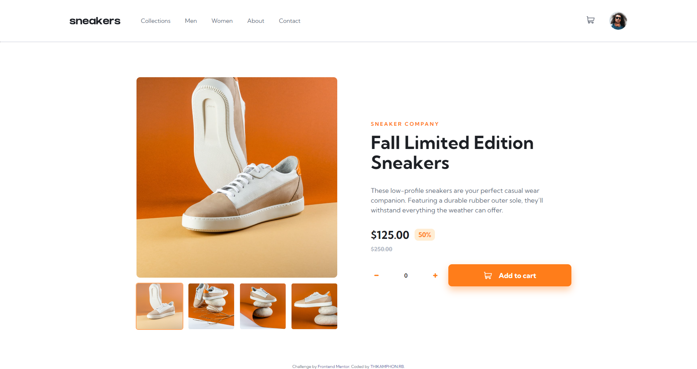

# Frontend Mentor - E-commerce-Product-Page-Main

The technical I use in this project is basic HTML CSS and JS only.

# Overview

  

# Links
- Solution URL: (https://github.com/thikamphon/ecommerce-product-page-main)
- Live Site URL: (https://thikamphon.github.io/ecommerce-product-page-main/)

# Built with

- HTML5
- CSS
- JS

## Author

- Frontend Mentor - [@thikamphon.RB](https://www.frontendmentor.io/profile/thikamphon)
